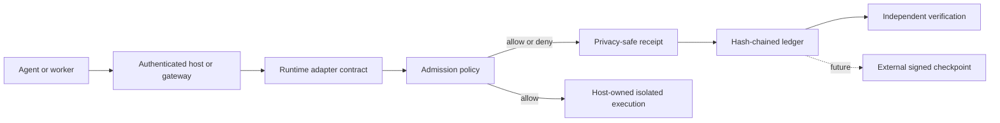

# Agent ProofChain

[](https://github.com/JalenBuildsHub/agent-proofchain/actions/workflows/ci.yml)
[](LICENSE)
[](pyproject.toml)
[](ROADMAP.md)

**Provider-neutral admission decisions and tamper-evident action receipts for AI agents.**

Agent ProofChain evaluates an agent's authenticated runtime identity and requested capability
before work begins, detects configured instruction-injection combinations, and writes a
privacy-safe receipt for every allow or deny decision.

It is deliberately small. It does not execute agents, manage credentials, or pretend that prompt
scanning is authentication. Use it beside real process isolation, short-lived credentials, scoped
worktrees, target authorization, and human-controlled enrollment.

## Run the complete local demo

```bash
python -m venv .venv
python -m pip install -e ".[dev]"
proofchain demo
```

Expected shape:

```text
Agent ProofChain demo
=====================
ALLOW  safe read request: true
DENY   unauthorized + injection-shaped mutation: true
VERIFY receipt chain: true (2 receipts)
EVAL   synthetic decisions: 4/4 matched, 0 false allows, 0 false denies
TAMPER expected outcomes: 5/5 matched
```

The demo is network-free, creates only temporary local evidence, and emits no raw request content
or caller-controlled identity. Use `proofchain demo --json` for machine-readable output.

## Why this exists

Multi-agent teams need answers to ordinary but consequential questions:

1. Who requested the action?
2. Which authenticated runtime and model attribution were used?
3. Was that actor allowed to use the requested capability?
4. Which policy checks allowed or denied the request?
5. Can the resulting record be verified later?

Application logs are useful, but they usually do not provide a portable, versioned admission
contract. Agent ProofChain makes those decisions and receipts testable across OpenAI, Anthropic,
Google, local, and other model runtimes.

Read [Why not just use logs?](docs/WHY_NOT_JUST_LOGS.md).

## Architecture



The host authenticates identity and owns execution. Agent ProofChain evaluates the admission
request and records the decision. See [Architecture](docs/ARCHITECTURE.md) and
[Runtime adapter contract](docs/ADAPTER_CONTRACT.md).

## Core guarantees

- Default-deny capability policy.
- Claimed actor family must match the authenticated runtime family supplied by the host.
- Model, runtime, actor, capability, action, source, and content are recorded as SHA-256 digests
  alongside the decision and safe reason codes.
- Caller-controlled request fields are not written to the ledger in plaintext.
- Receipt rows form a SHA-256 hash chain that can be verified independently.
- Synthetic evaluation fixtures cover spoofing, unauthorized mutation, injection-shaped content,
  missing model attribution, reason-code contracts, threshold boundaries, and ledger tampering.

## What it does not prove

- It does not authenticate a network caller or provider transport.
- It does not issue or store credentials.
- It does not sandbox a process, filesystem, browser, or container.
- It does not guarantee prompt-injection detection.
- An allow decision does not prove that the requested action is correct or safe.
- A local hash chain cannot detect deletion of the final receipt without an external checkpoint.
- Synthetic benchmark accuracy is not a security certification.

Read [Threat model](docs/THREAT_MODEL.md) and [Limitations](docs/LIMITATIONS.md) before production
integration.

## Common use cases

Agent ProofChain is designed to sit in front of consequential tool boundaries such as:

- repository mutation and pull-request creation;
- cloud deployment or infrastructure changes;
- outbound email, messaging, and publishing;
- payment or financial-action requests;
- access to private data;
- remote-worker task acceptance;
- handoffs between local and cloud agents.

The host remains responsible for the real tool permission, transaction approval, and rollback.

## Quick start with files

```bash
proofchain evaluate \
  --policy examples/policy.json \
  --request examples/safe-request.json \
  --ledger proofchain.db

proofchain verify --ledger proofchain.db
```

An injection-shaped example should be denied:

```bash
proofchain evaluate \
  --policy examples/policy.json \
  --request examples/injection-request.json \
  --ledger proofchain.db
```

See `examples/gateway_adapter.py` for a minimal authenticated-host integration pattern.

## Portable evaluation

The v0.2 pilot includes:

- a 40-case synthetic corpus grouped by identity, authorization, attribution, injection,
  threshold-boundary, benign-security-language, and compound-policy categories;
- allow and deny precision/recall, false-allow and false-deny rates, category summaries,
  reason-code assertions, and local process latency measurements;
- JSON and Markdown reports with a stable fixture digest;
- deterministic ledger mutation tests;
- provider-neutral adapter contracts for OpenAI, Anthropic, Google, and local runtimes;
- cross-platform CI on Ubuntu and Windows under Python 3.11 and 3.13.

```bash
proofchain eval \
  --policy examples/policy.json \
  --fixtures evals/synthetic-v0.2.json \
  --output artifacts/eval-v0.2.json \
  --markdown-output artifacts/eval-v0.2.md

proofchain tamper-eval \
  --output artifacts/tamper-v0.2.json \
  --markdown-output artifacts/tamper-v0.2.md
```

Read [Evaluation methodology](docs/EVALUATION_V0_2.md).

## Portable receipt protocol

The repository includes a draft receipt-v2 JSON Schema, a receipt-chain vector schema, and a
deterministic test vector implemented by both the Python package and a dependency-free JavaScript
verifier.

```bash
proofchain conformance \
  --vector spec/vectors/receipt-chain-v2.json \
  --output artifacts/conformance-v1.json

node examples/verify_receipt_vector.mjs spec/vectors/receipt-chain-v2.json
```

Both verifiers recompute canonical payload JSON and receipt hashes, validate sequence and
previous-hash linkage, reject caller-controlled plaintext, and return machine-readable errors.
The reference vector's expected final hash is:

```text
abd74ad6e6c978f83a1d95fb58a6fdc481d80e0dc84613a3b3a031d0c8e465ee
```

Read the [draft protocol specification](docs/PROTOCOL_SPEC.md). Conformance means compatible
serialization and verification behavior; it is not a security certification.

## Reusable GitHub Action

The composite action generates demo, conformance, evaluation, and tamper evidence in a caller's
CI workflow without requiring a hosted service.

```yaml
- name: Generate Agent ProofChain evidence
  id: proofchain
  uses: JalenBuildsHub/agent-proofchain@REVIEWED_COMMIT_SHA
  with:
    output-directory: proofchain-evidence
    policy: policy/agent-policy.json
    fixtures: evals/agent-fixtures.json

- uses: actions/upload-artifact@v4
  with:
    name: proofchain-evidence
    path: ${{ steps.proofchain.outputs.evidence-directory }}
```

Pin the action to a reviewed commit SHA or immutable release tag. The action evaluates evidence;
it does not authenticate a provider, execute tools, mutate the repository, or certify production
security. Read [GitHub Action guide](docs/GITHUB_ACTION.md).

## Project direction

The long-term goal is an inspectable, provider-neutral admission and receipt protocol that can be
implemented and verified outside the original Python package.

Near-term gates include:

- independently authored or externally reviewed fixtures;
- clean-install receipts from outside the maintainer environment;
- provider SDK examples that preserve authenticated host context;
- benchmark methodology versioning;
- external review of cross-language canonicalization edge cases;
- signed external checkpoints.

Read [Vision](VISION.md), [Roadmap](ROADMAP.md), and
[Adoption roadmap](docs/ADOPTION_ROADMAP.md).

## Contributing

Useful contributions include:

- independently authored synthetic fixtures;
- benign-language cases that expose false positives;
- cross-platform fixes;
- conformance and compatibility tests;
- additional independent verifiers using the published vector;
- privacy-preserving report improvements;
- provider integration examples with explicit trust boundaries;
- documentation corrections and clearer examples.

Read [Contributing](CONTRIBUTING.md), [Code of conduct](CODE_OF_CONDUCT.md), and
[Support](SUPPORT.md). Security vulnerabilities must be reported privately according to
[Security policy](SECURITY.md).

## Open-source portfolio

The wider [studio open-source portfolio](docs/OPEN_SOURCE_PORTFOLIO.md) and
[program stack](docs/PROGRAM_STACK.md) explain how related tools can grow around the
provider-neutral core without exposing private studio infrastructure.

## Status

`v0.1.0` is an alpha foundation. APIs and receipt schemas may change before a stable release.
The v0.2 evaluation and draft protocol work remain pre-release until independent fixtures,
external review, and at least one outside implementation exist.
